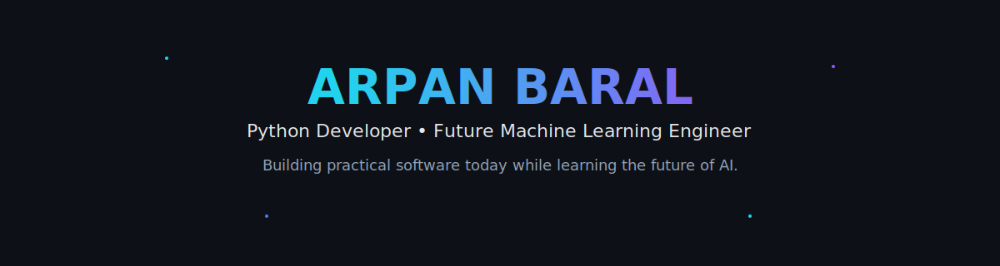

<div align="right">


</div>

<div align="center">



<br>


</div>


[](https://github.com/arpan085)
[](https://linkedin.com/in/arpan-baral)
[](https://arpan-baral.com.np/)
[](mailto:arpanbaral085@gmail.com)
[](https://twitter.com/arpan085)


---


##  About Me

```python
from developer import PythonDeveloper
from ai import MachineLearning


class ArpanBaral(PythonDeveloper):
    name = "Arpan Baral"
    location = "Kathmandu, Nepal"

    current_focus = [
        "CheapFlix Nepal ",
        "Portfolio",
        "Open Source",
    ]

    learning = MachineLearning(
        python="Advanced",
        numpy=True,
        pandas=True,
        backend=True,
        ai=True,
    )

    mission = (
        "Building practical software today "
        "while growing into AI and Machine Learning."
    )
```

<table>
<tr>
<td>

 Python

</td>
<td>

 Git

</td>
<td>

 Linux

</td>
<td>

 Computer Vision

</td>
</tr>
</table>


##  Developer Snapshot

<table>

<tr>

<td width="50%">

### Current Focus

- Building practical software
- Learning Machine Learning
- Improving Python skills
- Exploring AI technologies
- Preparing for Computer Science abroad

</td>

<td width="50%">

### Interests

- Artificial Intelligence
- Machine Learning
- Backend Development
- Automation
- Open Source
- Building useful products

</td>

</tr>

</table>


##  Current Journey

```text
Python
    │
    ▼
Data Structures
    │
    ▼
NumPy & Pandas
    │
    ▼
Machine Learning
    │
    ▼
Deep Learning
    │
    ▼
Large Language Models
    │
    ▼
MLOps
```


##  Philosophy

> I enjoy turning ideas into real projects.
> Every project teaches something new,
> and every challenge is an opportunity to improve.


---

##  Tech Stack

<div align="center">

### Languages

<p>


</p>

### Frontend

<p>


</p>

### Backend

<p>


</p>

### Database

<p>


</p>

### Tools

<p>


</p>

### Currently Learning

<p>


</p>

<table>

<tr>

<td align="center" width="20%">


<br>

<b>NumPy</b>

</td>

<td align="center" width="20%">


<br>

<b>Pandas</b>

</td>

<td align="center" width="20%">


<br>

<b>Scikit-Learn</b>

</td>

<td align="center" width="20%">


<br>

<b>LLMs</b>

</td>

<td align="center" width="20%">


<br>

<b>Jupyter</b>

</td>

</tr>

</table>

</div>

---


##  Skills Progress

| Technology | Level |
|------------|-------|
| Python | ████████░░ |
| JavaScript | ██████░░░░ |
| React | ██████░░░░ |
| Node.js | ██████░░░░ |
| Git & GitHub | ███████░░░ |
| Machine Learning | ███░░░░░░░ |
| NumPy | ███░░░░░░░ |
| Pandas | ███░░░░░░░ |

> Learning is a journey, not a race.


##  Development Environment

<table>

<tr>

<td>

<b>Operating System</b>

<br>

Windows

</td>

<td>

<b>Editor</b>

<br>

Visual Studio Code

</td>

<td>

<b>Terminal</b>

<br>

PowerShell • CMD

</td>

<td>

<b>Font</b>

<br>

JetBrains Mono

</td>

</tr>

</table>

---


##  Learning Roadmap

```text
Python
   │
   ▼
Object-Oriented Programming
   │
   ▼
Data Structures & Algorithms
   │
   ▼
NumPy
   │
   ▼
Pandas
   │
   ▼
Data Analysis
   │
   ▼
Machine Learning
   │
   ▼
Deep Learning
   │
   ▼
Large Language Models
   │
   ▼
MLOps
```


##  Terminal

```bash
arpan@github:~$ whoami

Arpan Baral

Python Developer

Kathmandu, Nepal

arpan@github:~$ current_focus

Building Projects
Learning Machine Learning
Preparing for Computer Science Abroad

arpan@github:~$ hobbies

Travel
Chess
Guitar
Flute
Learning New Things

arpan@github:~$ cat engine.log

Powered by millions of nested if/else statements
and one while(true) loop that nobody remembers writing.
```


#  GitHub Analytics

<div align="center">


</div>

<br>

<div align="center">


</div>

##  Contribution Activity

<div align="center">


</div>


##  Achievements

<div align="center">


</div>

---

##  Contribution Snake

<div align="center">


</div>

---


#  Featured Projects

<table>

<tr>

<td width="50%">


## CheapFlix Nepal

Affordable premium subscriptions for Nepal with a clean and simple experience.

### Highlights

- Subscription marketplace
- Responsive UI
- Secure authentication
- Modern dashboard

### Tech Stack


<br><br>

<a href="https://github.com/arpan085/cheapflix-nepal">

</a>

<a href="https://cheapflixnepal.live">

</a>

</td>

<td width="50%">


</td>

</tr>

</table>

---

<table>

<tr>

<td width="50%">

## Portfolio

A modern personal website built to showcase my work, learning journey, and projects.

### Highlights

- Responsive Design
- Modern UI
- Performance Focused
- Minimal Design

### Tech Stack


<br><br>

<a href="https://github.com/arpan085/portfolio">

</a>

<a href="https://arpan-baral.com.np">

</a>

</td>

<td width="50%">


</td>

</tr>

</table>

---
<table>

<tr>

<td width="50%">

## Python Projects

A collection of projects created while learning Python, automation, and backend development.

### Includes

- Automation Scripts
- CLI Applications
- API Experiments
- Problem Solving

### Tech


</td>

<td width="50%">


</td>

</tr>

</table>

---
##  Coming Soon

| Project | Description |
|----------|-------------|
| ML Playground | Experiments with Machine Learning algorithms |
| AI Assistant | Personal AI assistant built with Python |
| Computer Vision | Image classification and object detection |
| NLP Projects | Text analysis and language processing |
| Automation Toolkit | Python utilities for everyday tasks |

---
##  What I'm Building

```text
✓ CheapFlix Nepal
✓ Personal Portfolio
✓ Python Learning Projects

━━━━━━━━━━━━━━━━━━━━━━━━━━━━━━━

Next

→ Machine Learning Projects

→ AI Applications

→ Open Source Contributions

━━━━━━━━━━━━━━━━━━━━━━━━━━━━━━━
```


##  Current Activity

```text
Currently Building
──────────────────────────────────────

✓ CheapFlix Nepal

✓ Personal Portfolio

✓ Python Learning Projects

──────────────────────────────────────

Currently Learning

• Advanced Python

• Data Structures

• NumPy

• Pandas

• Machine Learning

──────────────────────────────────────

Next Goal

→ Build AI-powered applications

→ Contribute to Open Source

→ Study Computer Science Abroad
```

---


##  Road to AI

```text
2026

▰▰▰▰▱▱▱▱▱▱

Strengthen Python
Build Better Projects

↓

2027

▰▰▰▰▰▰▱▱▱▱

Machine Learning
Deep Learning
Open Source

↓

2028

▰▰▰▰▰▰▰▰▱▱

Computer Science
AI Research
Production AI Systems
```

---


<div align="center">

<i>Building practical software today while learning the future of AI.</i>

</div>
